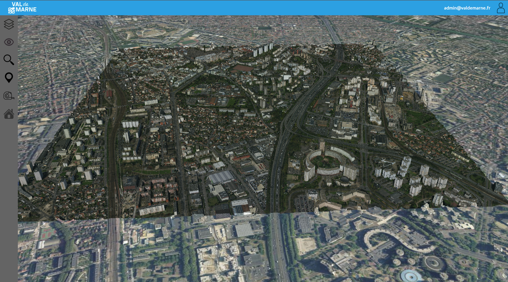

# INSTALLATION - VAL3D:
*Documentation d'installation - Jules Pierrat - 08/03/2022 - v1.1.0*

------------------------------

## 1.Installation d’un serveur Web Apache et d’une base de données :
La première étape pour l’installation de Val3D sur votre serveur est de configurer un serveur Web Apache 
(PHP 7.2 ou plus) ainsi qu’une base de données. Il est conseillé d’accéder à cette base de données via une interface 
graphique comme phpMyAdmin pour la suite.


## 2. Installation basique du projet VAL3D:
Une fois le serveur Web configuré, on peut ajouter le contenu du répertoire GitHub à la racine du serveur 
Web (généralement `/var/www/html` pour un serveur LAMP).
````bash
cd /var/www/html
git clone https://github.com/JulesPierrat/VAL3D.git .
````
Plusieurs choses sont alors à configurer.

### 2.1. Les fichier PATH.txt

Les fichier PATH.txt doit contenir le chemin d’accès à la racine du serveur Web (pour le serveur LAMP 
`/var/www/html`).

Il y en a deux à configurer, `./server/PATH.txt` et `./php/PATH.txt`

Vous pouvez égalment lancer cette commande qui génèrera automatiquement les fichiers PATH.txt (Linux):

```bash
echo pwd > ./server/PATH.txt
echo pwd > ./php/PATH.txt
```

### 2.2. Création de la base de données :

Dans l’interface phpMyAdmin, il faut créer une nouvelle base de données (par exemple val3d) et y importer 
le fichier SQL présent dans le répertoire bd (`./bd/val3d.sql`).

On retrouve alors 
les tables suivantes au sein de cette base de données :


| Tables      | Description |
|-------------|-------------|
| layer       | Table qui contient l'ensemble des descriptions des différentes couches géographiques |
| plugin      | Table qui contient  l'ensemble des informations nécessaires pour charger des plugins dans l'application |
| users       | Table de définition de l'ensemble des utilisateurs et de leurs permissions |
| poi         | Table de définition des Points Of Interest (POI) |
| bim         | Table de définitions des projet BIM |

Dans un deuxième temps, il est nécessaire de créer un nouvel utilisateur qui peut accéder à cette base de 
données depuis localhost (exemple : VAL3D_client@localhost) mais qui ne peut exécuter que la commande 
« SELECT ».

Vous trouverez un tutoriel détaillé [ici](https://www.h-hennes.fr/blog/2014/12/11/creer-un-utilisateur-mysql-avec-phpmyadmin/)

*Note : Il est important de vérifier l’encryptage de la base de données car cela peut provoquer des erreurs si elle est remplie avec certains caractères comme les accents.*

### 2.3. Accès à la base de données

Le fichier conf/connectBDD.txt doit contenir l’ensemble des informations de connexion à la base de 
données définit à l'étape précédente:

`./conf/ConnectBDD.txt`
```
host=localhost
username=root
password=
bd=val3d
```

### 2.4 Gestion du répertoire data :
Le répertoire data (/var/www/html/data) permet de stocker toutes les données géographiques qui ne sont 
pas stockées sur un serveur extérieur.

Avec ce gitHub, il vous est fournit un échantillon de données. Elles sont déjà renseigné dans la base de donnée si vous avez utilisé le fichier `./bd/val3d.sql`.

Dans le cas où le volume de données à stocker est très important, il est 
conseillé de déplacer le répertoire data sur une partition permettant de stocker un tel volume. 

Il suffit alors de créer un lien symbolique dans le répertoire souche du serveur web qui pointe sur le nouveau répertoire data.

```bash
ln -s <.../.../data> </var/www/html>
```
Une fois toutes ces étapes réalisées, VAL3D est fonctionnel dans un navigateur Web. On peut retrouver la 
liste de tous les outils sur la gauche.

## 3. Accès à VAL3D

Val3D est donc accessible à ces liens :

[Version que vous venez d'installer](http://localhost)

[Version du Conseil Départemental du Val de Marne](https://vm3d-prep-app)


Pour la version basique, il existe deux comptes avec des accès privillégiés:

| Email | Mot de passe |
| ----- | ------------ |
| admin@valdemarne.fr | val3D |
| advanced@valdemarne.fr | val3D |

Vous pouvez vous connecter à ces comptes grâce au bouton en haut à droite de l'interface.



## 4. Configuration

Nous verrons la configuration [ici](./CONFIGURATION.md) 